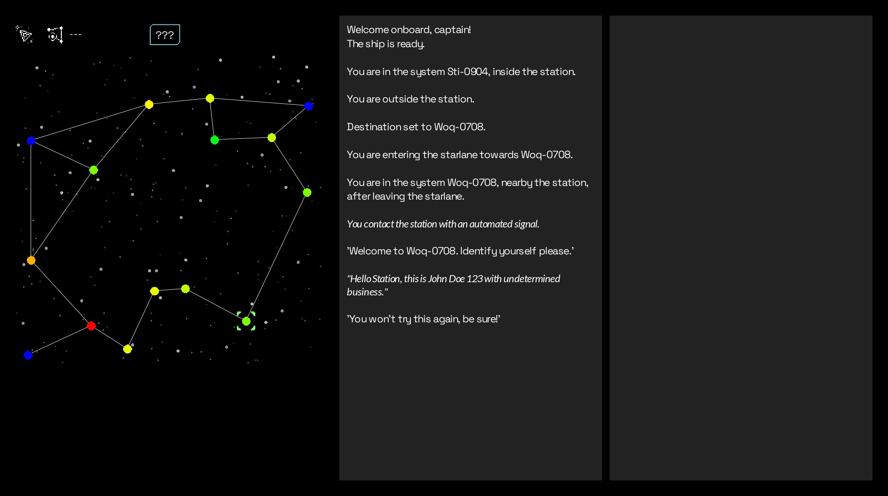
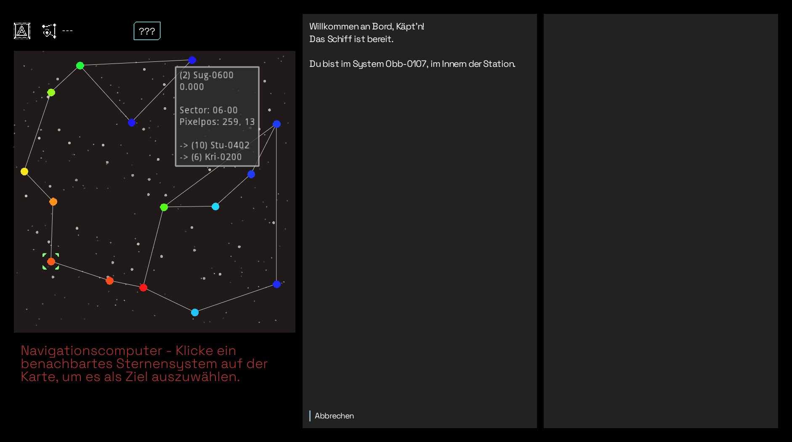
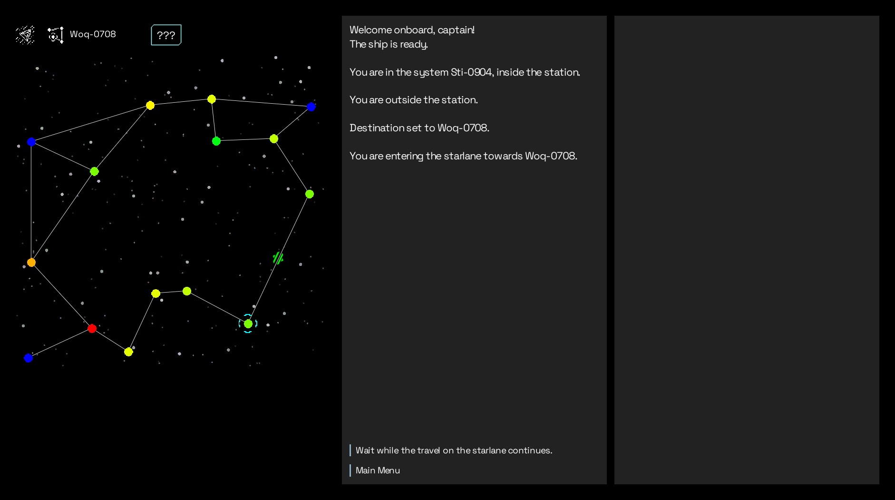
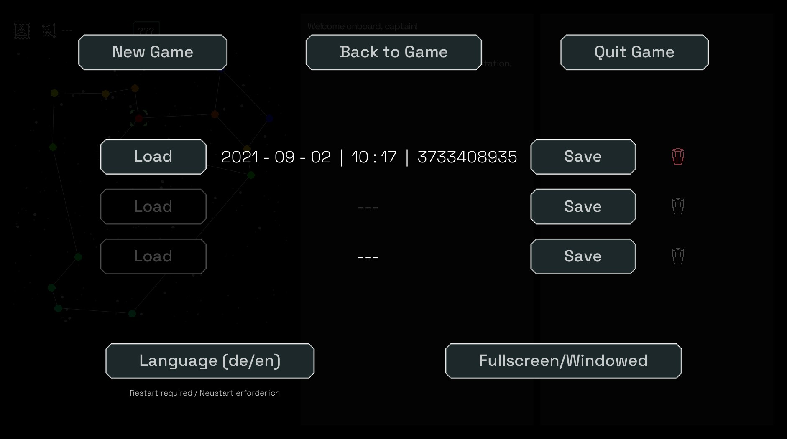

# StarText Adventures

Choice-based text adventure about space travel, trading, politics and everything else you love in a good space opera.

Things will be as much procedurally generated as possible.

## Current state

**September 2021**: It runs, but there is nothing more to do than uninteresting travelling and getting stuck in a docking dialogue once you try to enter a station again.

Menu is fully functional, save/load and language switching working (at least on my machine).

## Screenshots

Some screenshots, newest on top:

*Docking procedure gone bad*

----

*Operating the navigation computer (german)*

----

*Travelling on a starlane, as indicated on the map*

----

*Main menu of the game*

----